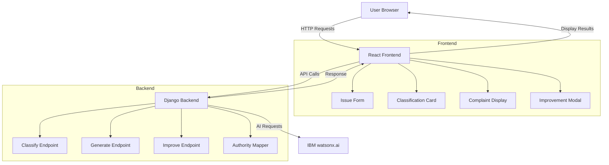
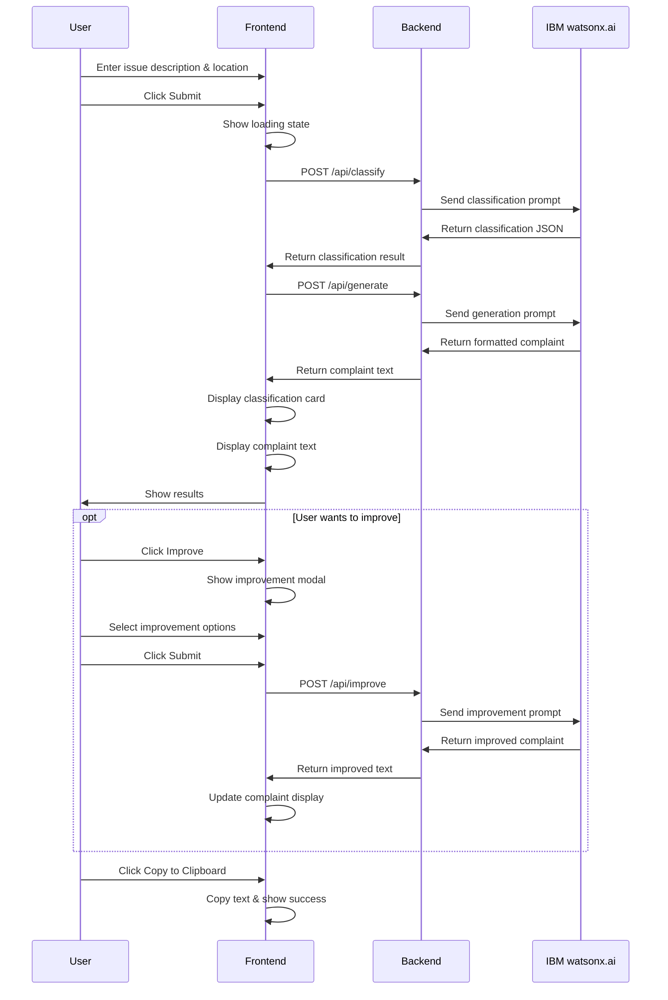

# CivicFix - Technical Implementation Plan

## Project Overview
CivicFix is an AI-powered civic issue reporting system that helps citizens transform informal complaints into professional, structured reports suitable for government submission.

## Architecture Overview



## Technology Stack

### Frontend
- **Framework**: React 18+ with Create React App
- **Styling**: Tailwind CSS for responsive design
- **HTTP Client**: Axios for API communication
- **State Management**: React Hooks (useState, useEffect)
- **Icons**: React Icons or Heroicons

### Backend
- **Framework**: Django 4.x with Django REST Framework
- **AI Integration**: IBM watsonx.ai Python SDK
- **Model**: flan-t5-xl-3b (cost-effective, good performance)
- **CORS**: django-cors-headers for cross-origin requests
- **Environment**: python-dotenv for configuration

### Deployment
- **Frontend**: AWS S3 + CloudFront or Azure Static Web Apps
- **Backend**: AWS EC2/ECS or Azure App Service
- **Alternative**: Docker containers for both services

## Project Structure

```
civicfix/
├── backend/
│   ├── civicfix_api/
│   │   ├── __init__.py
│   │   ├── settings.py
│   │   ├── urls.py
│   │   └── wsgi.py
│   ├── api/
│   │   ├── __init__.py
│   │   ├── views.py
│   │   ├── serializers.py
│   │   ├── urls.py
│   │   ├── ai_service.py
│   │   ├── authority_mapper.py
│   │   └── prompts.py
│   ├── manage.py
│   ├── requirements.txt
│   └── .env.example
├── frontend/
│   ├── public/
│   ├── src/
│   │   ├── components/
│   │   │   ├── IssueForm.jsx
│   │   │   ├── ClassificationCard.jsx
│   │   │   ├── ComplaintDisplay.jsx
│   │   │   ├── ImprovementModal.jsx
│   │   │   └── LoadingSpinner.jsx
│   │   ├── services/
│   │   │   └── api.js
│   │   ├── utils/
│   │   │   └── constants.js
│   │   ├── App.jsx
│   │   ├── App.css
│   │   └── index.js
│   ├── package.json
│   ├── tailwind.config.js
│   └── .env.example
├── docs/
│   └── deployment.md
└── README.md
```

## Backend Implementation Details

### API Endpoints

#### 1. POST /api/classify
**Request:**
```json
{
  "issueDescription": "There is garbage piling up on Main Street for the past week",
  "location": "Main Street, Ward 5"
}
```

**Response:**
```json
{
  "category": "Sanitation",
  "severity": "medium",
  "urgency": "high",
  "authority": {
    "department": "Municipal Corporation - Sanitation Department",
    "jurisdiction": "Ward Office",
    "contact": "Ward Officer or Sanitation Inspector"
  },
  "reasoning": "Garbage accumulation affects public health and requires prompt attention"
}
```

#### 2. POST /api/generate
**Request:**
```json
{
  "issueDescription": "There is garbage piling up on Main Street for the past week",
  "location": "Main Street, Ward 5",
  "classification": {
    "category": "Sanitation",
    "severity": "medium",
    "urgency": "high"
  }
}
```

**Response:**
```json
{
  "formattedComplaint": "To,\nThe Sanitation Officer\nMunicipal Corporation\n[City Name]\n\nSubject: Complaint Regarding Garbage Accumulation on Main Street, Ward 5\n\nRespected Sir/Madam,\n\nI am writing to bring to your attention a serious sanitation issue..."
}
```

#### 3. POST /api/improve
**Request:**
```json
{
  "complaint": "Original complaint text...",
  "improvementTypes": ["make_formal", "add_urgency", "reference_rights"]
}
```

**Response:**
```json
{
  "improvedComplaint": "Enhanced complaint text with requested improvements..."
}
```

### AI Prompt Engineering

#### Classification Prompt Template
```python
CLASSIFICATION_PROMPT = """
You are an AI assistant that classifies civic issues for government reporting.

Analyze the following civic issue and provide a structured classification:

Issue: {issue_description}
Location: {location}

Classify this issue into ONE of these categories:
- Sanitation (garbage, waste management, cleanliness)
- Road Infrastructure (potholes, road damage, broken roads)
- Water Supply (leakage, broken pipes, water shortage)
- Electricity (power outage, streetlight issues, electrical problems)
- Drainage (blocked drains, flooding, sewage)
- Public Safety (illegal construction, noise pollution, safety hazards)
- Other (any other civic issue)

Assess severity level: low, medium, high, critical
Determine urgency: low, medium, high, immediate

Respond ONLY with valid JSON in this exact format:
{
  "category": "category_name",
  "severity": "severity_level",
  "urgency": "urgency_level",
  "reasoning": "brief explanation"
}
"""
```

#### Complaint Generation Prompt Template
```python
GENERATION_PROMPT = """
You are an expert in writing formal government complaints.

Create a professional, well-structured complaint letter based on:

Issue: {issue_description}
Location: {location}
Category: {category}
Severity: {severity}
Urgency: {urgency}

The complaint should:
1. Use formal government correspondence format
2. Include proper salutation and subject line
3. Clearly state the problem with specific details
4. Mention the location explicitly
5. Request appropriate action
6. Use respectful, professional language
7. Be concise but comprehensive (200-300 words)
8. Include proper closing

Generate the complete complaint letter:
"""
```

#### Improvement Prompt Template
```python
IMPROVEMENT_PROMPT = """
You are an expert in enhancing government complaints.

Original Complaint:
{original_complaint}

Improvement Instructions:
{improvement_instructions}

Enhance the complaint by:
{specific_improvements}

Maintain the original structure and facts while making the requested improvements.
Ensure the enhanced complaint remains professional and actionable.

Generate the improved complaint:
"""
```

### Authority Mapping Logic

```python
AUTHORITY_MAP = {
    "Sanitation": {
        "department": "Municipal Corporation - Sanitation Department",
        "jurisdiction": "Ward Office",
        "contact": "Ward Sanitation Officer",
        "typical_response_time": "3-5 days"
    },
    "Road Infrastructure": {
        "department": "Public Works Department (PWD)",
        "jurisdiction": "Municipal Corporation",
        "contact": "Executive Engineer - Roads",
        "typical_response_time": "7-14 days"
    },
    "Water Supply": {
        "department": "Water Board / Public Health Engineering",
        "jurisdiction": "Water Supply Division",
        "contact": "Assistant Engineer - Water Supply",
        "typical_response_time": "2-3 days for emergencies"
    },
    "Electricity": {
        "department": "Electricity Board / Power Distribution Company",
        "jurisdiction": "Local Sub-Division",
        "contact": "Sub-Divisional Officer (SDO)",
        "typical_response_time": "24-48 hours"
    },
    "Drainage": {
        "department": "Municipal Corporation - Drainage Department",
        "jurisdiction": "Ward Office",
        "contact": "Drainage Inspector",
        "typical_response_time": "3-7 days"
    },
    "Public Safety": {
        "department": "Municipal Corporation / Local Police",
        "jurisdiction": "Ward Office / Police Station",
        "contact": "Ward Officer / Station House Officer",
        "typical_response_time": "Immediate for emergencies"
    },
    "Other": {
        "department": "Municipal Corporation - General Administration",
        "jurisdiction": "Ward Office",
        "contact": "Ward Officer",
        "typical_response_time": "5-10 days"
    }
}
```

## Frontend Implementation Details

### Component Structure

#### IssueForm Component
- Large textarea for issue description (min 50 chars)
- Text input for optional location
- Submit button with loading state
- Form validation and error display

#### ClassificationCard Component
- Category display with icon
- Severity indicator with color coding:
  - Low: Green (#10B981)
  - Medium: Yellow (#F59E0B)
  - High: Orange (#F97316)
  - Critical: Red (#EF4444)
- Urgency badge
- Authority information section
- Responsive card layout

#### ComplaintDisplay Component
- Formatted text display with proper line breaks
- Copy to clipboard button
- Improve button to open modal
- Success feedback on copy

#### ImprovementModal Component
- Checkbox options for improvements:
  - Make more formal
  - Add urgency emphasis
  - Reference citizen rights
  - Include policy violations
  - Strengthen language
  - Add legal references
- Submit button
- Close/cancel option

### API Service Layer

```javascript
// src/services/api.js
import axios from 'axios';

const API_BASE_URL = process.env.REACT_APP_API_URL || 'http://localhost:8000/api';

export const classifyIssue = async (issueDescription, location) => {
  const response = await axios.post(`${API_BASE_URL}/classify`, {
    issueDescription,
    location
  });
  return response.data;
};

export const generateComplaint = async (issueDescription, location, classification) => {
  const response = await axios.post(`${API_BASE_URL}/generate`, {
    issueDescription,
    location,
    classification
  });
  return response.data;
};

export const improveComplaint = async (complaint, improvementTypes) => {
  const response = await axios.post(`${API_BASE_URL}/improve`, {
    complaint,
    improvementTypes
  });
  return response.data;
};
```

### User Flow



## Styling Guidelines

### Color Palette
- **Primary**: #3B82F6 (Blue)
- **Secondary**: #6B7280 (Gray)
- **Success**: #10B981 (Green)
- **Warning**: #F59E0B (Yellow)
- **Danger**: #EF4444 (Red)
- **Background**: #F9FAFB (Light Gray)
- **Card Background**: #FFFFFF (White)

### Typography
- **Font Family**: Inter, system-ui, sans-serif
- **Headings**: font-semibold, text-2xl to text-lg
- **Body**: font-normal, text-base
- **Small Text**: text-sm

### Spacing
- **Container Padding**: p-4 to p-8
- **Card Padding**: p-6
- **Element Spacing**: space-y-4, gap-4

## Environment Configuration

### Backend (.env)
```
DJANGO_SECRET_KEY=your-secret-key
DEBUG=True
ALLOWED_HOSTS=localhost,127.0.0.1
CORS_ALLOWED_ORIGINS=http://localhost:3000

# IBM watsonx.ai Configuration
WATSONX_API_KEY=your-api-key
WATSONX_PROJECT_ID=your-project-id
WATSONX_URL=https://us-south.ml.cloud.ibm.com
WATSONX_MODEL_ID=ibm/granite-3-3-8b-instruct
```

### Frontend (.env)
```
REACT_APP_API_URL=http://localhost:8000/api
```

## Dependencies

### Backend (requirements.txt)
```
Django==4.2.7
djangorestframework==3.14.0
django-cors-headers==4.3.1
python-dotenv==1.0.0
ibm-watsonx-ai>=1.4.0
requests==2.31.0
```

### Frontend (package.json key dependencies)
```json
{
  "dependencies": {
    "react": "^18.2.0",
    "react-dom": "^18.2.0",
    "axios": "^1.6.2",
    "react-icons": "^4.12.0"
  },
  "devDependencies": {
    "tailwindcss": "^3.3.5",
    "autoprefixer": "^10.4.16",
    "postcss": "^8.4.32"
  }
}
```

## Testing Strategy

### Manual Testing Checklist
1. Submit issue with description only (no location)
2. Submit issue with both description and location
3. Test various issue categories (sanitation, roads, water, etc.)
4. Verify classification accuracy
5. Check complaint formatting and structure
6. Test improvement options individually and in combination
7. Verify copy-to-clipboard functionality
8. Test responsive layout on mobile, tablet, desktop
9. Check error handling for API failures
10. Verify loading states display correctly

### Sample Test Cases
```
Test Case 1: Garbage Issue
Input: "Garbage has been piling up near the park entrance for 2 weeks"
Location: "Central Park, Ward 12"
Expected: Category=Sanitation, Severity=Medium/High, Urgency=High

Test Case 2: Pothole Issue
Input: "Large pothole on highway causing accidents"
Location: "NH-44, near toll plaza"
Expected: Category=Road Infrastructure, Severity=High/Critical, Urgency=Immediate

Test Case 3: Water Leakage
Input: "Water pipe burst, water flowing on street"
Location: "MG Road, Sector 5"
Expected: Category=Water Supply, Severity=High, Urgency=Immediate
```

## Deployment Considerations

### AWS Deployment
- **Frontend**: S3 bucket + CloudFront CDN
- **Backend**: EC2 instance or ECS container
- **Database**: Not required (stateless)
- **Environment Variables**: AWS Systems Manager Parameter Store

### Azure Deployment
- **Frontend**: Azure Static Web Apps
- **Backend**: Azure App Service
- **Environment Variables**: Azure Key Vault

### Docker Deployment
```dockerfile
# Backend Dockerfile
FROM python:3.11-slim
WORKDIR /app
COPY requirements.txt .
RUN pip install -r requirements.txt
COPY . .
CMD ["gunicorn", "civicfix_api.wsgi:application", "--bind", "0.0.0.0:8000"]

# Frontend Dockerfile
FROM node:18-alpine
WORKDIR /app
COPY package*.json .
RUN npm install
COPY . .
RUN npm run build
CMD ["npx", "serve", "-s", "build", "-l", "3000"]
```

## Security Considerations

1. **API Key Protection**: Store IBM watsonx.ai credentials in environment variables
2. **CORS Configuration**: Restrict to specific frontend origins in production
3. **Input Validation**: Sanitize user inputs on backend
4. **Rate Limiting**: Implement rate limiting to prevent abuse
5. **HTTPS**: Use HTTPS in production for all communications
6. **Error Messages**: Don't expose sensitive information in error responses

## Performance Optimization

1. **Frontend**:
   - Lazy load components
   - Debounce API calls if implementing auto-save
   - Optimize images and assets
   - Use React.memo for expensive components

2. **Backend**:
   - Cache authority mapping data
   - Implement request timeout handling
   - Use connection pooling for AI API calls
   - Add response compression

## Future Enhancements (Out of Scope for MVP)

1. User authentication and complaint history
2. Image upload for visual evidence
3. Real-time complaint tracking
4. Multi-language support
5. SMS/Email notifications
6. Admin dashboard for authorities
7. Analytics and reporting
8. Mobile app (React Native)
9. Offline mode with sync
10. Integration with government portals

## Success Metrics

1. **Functionality**: All three AI operations work correctly
2. **Performance**: API response time < 5 seconds
3. **Usability**: Clean, intuitive interface
4. **Reliability**: Proper error handling and recovery
5. **Responsiveness**: Works on mobile, tablet, desktop
6. **Accessibility**: Basic WCAG compliance

## Timeline Estimate

- **Backend Setup**: 2-3 hours
- **AI Integration**: 2-3 hours
- **Frontend Setup**: 2-3 hours
- **Component Development**: 4-5 hours
- **Integration & Testing**: 2-3 hours
- **Documentation**: 1-2 hours
- **Total**: 13-19 hours

## Next Steps

Once this plan is approved, we'll switch to Code mode to implement the solution following this structure.
